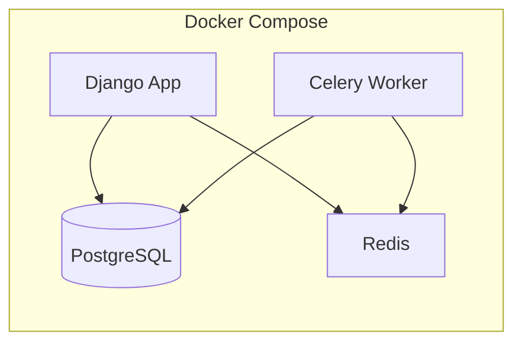

# Credit Approval System – Implementation Plan

## Current state

The workspace is effectively empty (only a README). The assignment expects you to have `customer_data.xlsx` and `loan_data.xlsx`; these are not in the repo. The plan assumes you will add them (e.g. under `data/`) before running ingestion.

---

## 1. Architecture overview



- **Django 4 + DRF**: REST API only (no frontend).
- **PostgreSQL**: Primary DB (via `django.db.backends.postgresql`).
- **Redis**: Broker for Celery.
- **Celery**: Background ingestion of `customer_data.xlsx` and `loan_data.xlsx`.

---

## 2. Project structure (target)

```
Alemeno-task/
├── docker-compose.yml          # app, postgres, redis, celery worker
├── Dockerfile                  # Python 3.11+, Django app
├── requirements.txt
├── manage.py
├── config/                     # Django project package
│   ├── settings.py
│   ├── urls.py
│   └── celery.py
├── credit_app/                 # Main application
│   ├── models.py               # Customer, Loan
│   ├── serializers.py
│   ├── views.py                # API views
│   ├── urls.py
│   ├── services/
│   │   ├── eligibility.py      # Credit score + approval + corrected rate
│   │   └── emi.py              # Compound-interest EMI
│   ├── tasks.py                # Celery: ingest customers, ingest loans
│   └── management/commands/
│       └── ingest_initial_data.py   # Enqueue ingestion tasks
├── data/                       # Place xlsx files here
│   ├── customer_data.xlsx
│   └── loan_data.xlsx
└── .env.example
```

---

## 3. Data models

**Customer** (aligned with `customer_data.xlsx` and `/register`):

- `customer_id` (PK, can be explicit or auto); `first_name`, `last_name`, `phone_number` (e.g. `CharField`), `monthly_salary` (DecimalField/IntegerField), `approved_limit` (IntegerField), `current_debt` (IntegerField, default 0). For `/register`: add `age` (IntegerField) and store `monthly_income` (same as `monthly_salary` for new customers).
- **Approved limit for new customers**: `approved_limit = round(36 * monthly_salary / 100000) * 100000` (nearest lakh; 1 lakh = 100,000).

**Loan** (aligned with `loan_data.xlsx` and APIs):

- `loan_id` (PK), `customer` (FK to Customer), `loan_amount`, `tenure` (months), `interest_rate`, `monthly_repayment` (EMI), `emis_paid_on_time` (int), `start_date`, `end_date`. Optional: `emis_paid` (int) for "repayments_left" as `tenure - emis_paid`.
- "Current" loans: those not yet fully repaid (e.g. `end_date` in future or `emis_paid < tenure`).

---

## 4. Background ingestion (initialization)

- **Stack**: Celery with Redis as broker. Use `django-celery-results` only if you need to query task status from the API; otherwise optional.
- **Libraries**: `openpyxl` or `pandas` (with `openpyxl`) to read `.xlsx`.
- **Flow**:
  1. Two Celery tasks: `ingest_customers_from_excel(path)` and `ingest_loans_from_excel(path)`.
  2. Management command `ingest_initial_data` (or similar) that:
     - Resolves paths to `data/customer_data.xlsx` and `data/loan_data.xlsx` (or from settings).
     - Calls `ingest_customers_from_excel.delay(customer_path)` and `ingest_loans_from_excel.delay(loan_path)`.
  3. Tasks read rows, map columns to model fields, and use `Customer.objects.update_or_create(customer_id=...)` and `Loan.objects.update_or_create(loan_id=...)` (with `customer_id` lookup for loans). Handle duplicates and validation (e.g. skip bad rows, log errors).
- **Run after compose up**: e.g. `docker compose run app python manage.py ingest_initial_data` (or from an entrypoint script that runs migrations then ingestion once).

---

## 5. EMI calculation (compound interest)

Use the standard compound-interest monthly installment formula:

- Monthly rate: `r = annual_interest_rate / (12 * 100)`.
- EMI = `P * r * (1+r)^n / ((1+r)^n - 1)` where `P` = loan amount, `n` = tenure in months.
- Implement in `credit_app/services/emi.py` and use it in eligibility check, create-loan, and view endpoints so all returned `monthly_installment` values are consistent.

---

## 6. Credit score and eligibility (check-eligibility)

- **Input**: `customer_id`, `loan_amount`, `interest_rate`, `tenure`.
- **Data**: Use only historical data from DB (loaded from `loan_data.xlsx` and any future loans). No need to read the Excel again at request time.

**Credit score (0–100)** – define a weighted formula using:

1. **Past loans paid on time**: e.g. ratio `(total EMIs paid on time) / (total EMIs due across all past/current loans)`.
2. **Number of loans in the past**: e.g. more loans (up to a cap) as positive signal.
3. **Loan activity in current year**: e.g. number or volume of loans in current year (normalized).
4. **Loan approved volume**: e.g. total approved loan amount over time (normalized).
5. **Override**: If `sum(current loan principals or outstanding) > customer.approved_limit` → **credit_score = 0**.

Normalize each component to a 0–100 scale and take a weighted sum (e.g. 40% on-time, 20% number of loans, 20% current-year activity, 20% volume), then cap at 100. Exact weights can be tuned; document them in code.

**Approval rules**:

- If `sum(current EMIs) > 0.5 * monthly_salary` → do not approve (response: `approval=False`).
- If `credit_score <= 10` → do not approve.
- If `10 < credit_score <= 30` → approve only if `interest_rate > 16%`; if approved, `corrected_interest_rate = max(requested_rate, 16)` (or "lowest of slab" = 16%).
- If `30 < credit_score <= 50` → approve only if `interest_rate > 12%`; `corrected_interest_rate = max(requested_rate, 12)`.
- If `credit_score > 50` → approve at requested rate; `corrected_interest_rate = interest_rate`.

**Response**: Always return `customer_id`, `approval`, `interest_rate`, `corrected_interest_rate`, `tenure`, and `monthly_installment` (EMI computed with `corrected_interest_rate` when approved, else can use requested rate for display).

---

## 7. API endpoints (summary)

| Method | Endpoint | Purpose |
|--------|----------|--------|
| POST | `/register` | Create customer; body: first_name, last_name, age, monthly_income, phone_number. Response: customer_id, name, age, monthly_income, approved_limit, phone_number. |
| POST | `/check-eligibility` | Body: customer_id, loan_amount, interest_rate, tenure. Response: customer_id, approval, interest_rate, corrected_interest_rate, tenure, monthly_installment. |
| POST | `/create-loan` | Body: customer_id, loan_amount, interest_rate, tenure. If eligible (reuse same logic as check-eligibility), create Loan and return loan_id, customer_id, loan_approved, message, monthly_installment; else loan_id null, loan_approved false, message. |
| GET | `/view-loan/<loan_id>` | Response: loan_id, customer (JSON: id, first_name, last_name, phone_number, age), loan_amount, interest_rate, monthly_installment, tenure. |
| GET | `/view-loans/<customer_id>` | Response: list of loans; each: loan_id, loan_amount, interest_rate, monthly_installment, repayments_left. |

- **Error handling**: 400 for validation errors, 404 for missing customer/loan, 500 for server errors. Use DRF status codes and exception handling in views/serializers.
- **URL namespace**: Mount under API prefix (e.g. `/api/`) if desired; assignment does not require a specific prefix.

---

## 8. Implementation details to unify

- **Register**: `name` = `first_name + " " + last_name`. Store `age` and `monthly_income`; set `approved_limit` per formula above; `current_debt` = 0.
- **create-loan**: Call the same eligibility logic as `check-eligibility` (in `services/eligibility.py`). If approved, create `Loan` with `interest_rate` = `corrected_interest_rate`, compute EMI, set `start_date` to today, `end_date` from tenure, `emis_paid_on_time` = 0 (and `emis_paid` = 0 if you add that field). Return the same `monthly_installment` in the response.
- **view-loan**: Include `customer` as nested JSON (id, first_name, last_name, phone_number, age).
- **view-loans**: Filter loans by `customer_id`; for "current" loans you may define as `end_date >= today` or `emis_paid < tenure`. `repayments_left` = `tenure - emis_paid` (add `emis_paid` to Loan if not already inferred from `emis_paid_on_time` or another field).

---

## 9. Dockerization

- **docker-compose.yml**: Services `db` (PostgreSQL 15), `redis`, `app` (Django runserver or gunicorn), `celery` (worker). App and Celery use the same image; app depends on db and redis; Celery depends on app (or same env) and redis.
- **Dockerfile**: Base image Python 3.11+; install dependencies from `requirements.txt`; set `WORKDIR`; run migrations in entrypoint or via a separate command. Do not install unnecessary dev tools in production image.
- **Environment**: `DATABASE_URL` or `POSTGRES_*`, `REDIS_URL`, `SECRET_KEY`, `DEBUG`. Use `.env` and document in `.env.example`.
- **Single command**: `docker compose up` should start DB, Redis, app, and Celery so that the app is usable and ingestion can be run with `docker compose run app python manage.py ingest_initial_data`.

---

## 10. Dependencies (requirements.txt)

- `Django>=4.0,<5`
- `djangorestframework`
- `psycopg2-binary` (or `psycopg[binary]` for async later)
- `celery[redis]`
- `django-celery-results` (optional)
- `openpyxl` (and optionally `pandas` for Excel)
- `gunicorn` (for production serve in Docker)
- `python-dotenv` (for env loading)

---

## 11. Order of implementation

1. Django project + DRF, settings (DB, Redis, Celery), `requirements.txt`, Dockerfile, docker-compose.
2. Models: Customer, Loan; migrations.
3. EMI service and eligibility service (credit score + approval + corrected rate).
4. Serializers and views for all five endpoints; URL routing.
5. Celery app config, ingest tasks, management command; wire ingestion to `customer_data.xlsx` and `loan_data.xlsx` paths.
6. Error handling and status codes across endpoints.
7. Manual testing with curl/Postman and fix edge cases (e.g. customer not found, loan not found, zero tenure).

---

## 12. Clarifications / assumptions

- **customer_data.xlsx / loan_data.xlsx**: Not in repo; you will place them in `data/` (or path in settings). Ingestion reads from the container's filesystem (volume-mount `./data` if needed).
- **Rounding "to nearest lakh"**: `round(36 * monthly_salary / 100000) * 100000` (integer).
- **Phone number**: Stored as string to preserve leading zeros and format; request/response use int per spec where stated.
- **Credit score weights**: Plan uses a single consistent formula in code; you can tune weights in `services/eligibility.py` and document them.

This plan gives a single, coherent path from an empty repo to a running, Dockerized credit approval system with background ingestion and all five APIs using compound-interest EMI and the specified approval rules.
